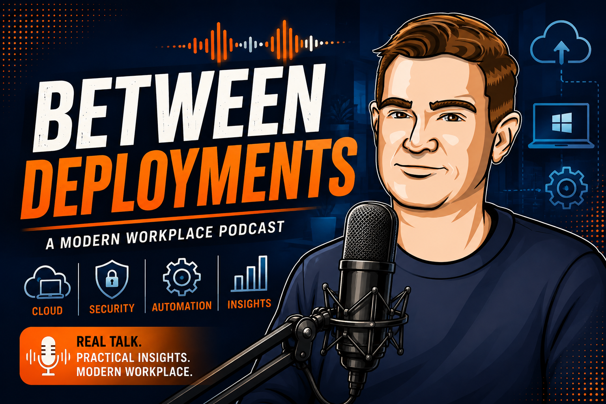

# Between Deployments

A conversation series about modern workplace IT — Intune, Entra ID, Windows 365, and everything that comes with managing devices in a cloud-native world. No fixed schedule, no filler: just honest conversations with people in the field, recorded whenever there's something worth talking about.

Hosted by **Jeroen Burgerhout** (Microsoft Intune MVP).

🌐 [betweendeployments.show](https://betweendeployments.show)  
🎧 [Subscribe via RSS](https://api.substack.com/feed/podcast/2886741.rss)

## How it works

A GitHub Action runs every 4 hours to fetch the podcast RSS feed from Substack and generate posts automatically.

Episode cards show a player and "Listen on" links driven by each post's `audio`, `duration`, and `link` front matter (filled in automatically by the fetch script) and by the `podcast:` block in [_config.yml](_config.yml). Add `spotify` / `apple_podcasts` URLs there once the show is listed on those platforms — the chips only appear once a URL is set.